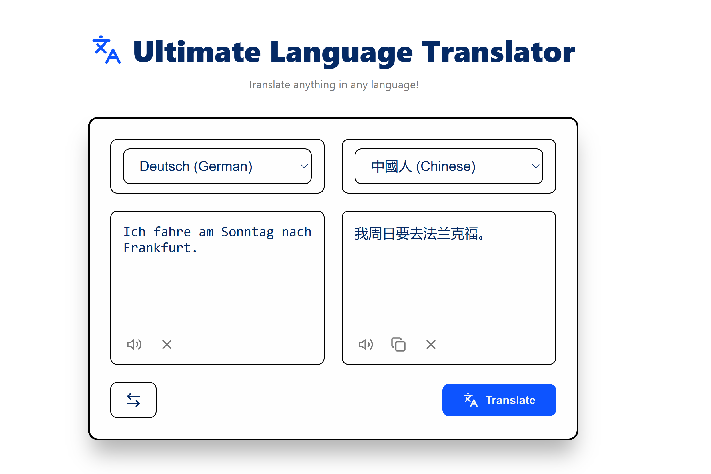

# 🌍 Translator Application using React


A lightweiht, repsonsive and fast multi-language translation web application, using the open-source
**Lingva Translate API**, **React** and **Vite**.



---

## License


## 📁 Application Structure Tree

```text
📁TranslatorApp
 ┣ public
 ┣ src
 ┃ ┣ assets
 ┃ ┣ components
 ┃ ┃ ┣ ControlBar.jsx
 ┃ ┃ ┣ Header.jsx
 ┃ ┃ ┣ Language.jsx
 ┃ ┃ ┗ TextCard.jsx
 ┃ ┣ constants
 ┃ ┃ ┗ languages.js
 ┃ ┣ hooks
 ┃ ┃ ┗ useTranslations.js
 ┃ ┣ services
 ┃ ┃ ┗ translateApi.js
 ┃ ┣ App.css
 ┃ ┣ App.jsx
 ┃ ┗ main.jsx
 ┣ image.png
 ┣ index.html
 ┣ .gitignore
 ┣ package.json
 ┣ ReadMe.md
 ┗ vite.config.js
```

---

## App Features

- 🔄️ **Multi-Language Support**: Translate your text in multiple languages.
- ⚡**Auto Detection**: Automatically detects the source text language.
- 🔀 **Swap Languages**: Easily toggle between two languages.
- 📋 **Copy to Clipboard**: You can copy the translation to your clipboard.
- 🔉 **Text to Speech** : You can convert the translation text into speech.
- 📱 **Responsive UI/UX**: Fully Responsive UI Design for every kind of device.

---

## ⚒️ Tech Stack

- **Front-End**: React (Vite)
- **Styling**: CSS3 (Flexbox/Grid)
- **Icons**: React Icons / Lucide-React
- **API**: MyMemory Translate API (1000 words/day for free without an API key)

---

## 🚀 Run the Application

### Prerequisites

Make sure you have **Node.js v.18.0 or higher** installed on your machine.

### Installation

- Clone the repository:

```bash
    git clone []()
```

- Navigate to the project directory:

```bash
    cd TranslatorApp
```

- Install dependencies:

```bash
    npm install
    npm install lucide-react
```

- Start the development server:

```bash
    npm run dev
```

---

## 🛑 Stop / Shutdown the server

To shutdown or stop the running development server, return to your terminal window and press:

- **Windows/Linux/macOS:** `Ctrl` + `C`
- Confirm with `Y` (and press `Enter`) if prompted to terminate the batch job.

---

## 🔄️ Alternative API Use (Lingva Translate API)

The application can be also work with the *Lingva Translate API*, which is a native browser API for fetching translations, an alternative front-end for Google Translate.

To use it, go to `src/services/translateApi.js` and change the JavaScript code with the following script:

```javascript
const BASE_URL = 'https://lingva.lingva.ml/api/v1';

export const translateText = async (text, source = 'auto', target = 'el') => {
    if (!text.trim()) return '';

    try {
        const encodedText = encodeURIComponent(text);
        const response = await fetch(`${BASE_URL}/${source}/${target}/${encodedText}`);

        if(!response.ok) {
            throw new Error('Error: Coonection with translation server failed!');
        }
        const data = await response.json();
        return data.translation;
    }
    catch (error) {
        console.log('API Error: ', error);
        throw new Error('The translation failed. Please try again!');
    }
};
```

>[!WARNING]
> Public Lingva instances may occasionally expirience rate limits or temporary downtime.If you encounter errors you can switch back to the MyMemory API or try an alternative Lingva mirror instance (e.g. `https://lingva.lingva.ml/api/v1`)[cite:9].

---
